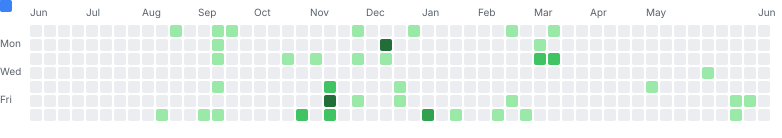
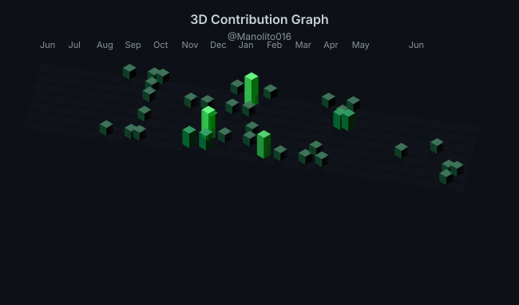

<!-- ═══════════════════════════════════════════════════════════════ -->
<!--  Manolito016 — GitHub Profile README                          -->
<!-- ═══════════════════════════════════════════════════════════════ -->

**AI Solution Developer · Full-Stack Engineer · Laravel Specialist**
 
Building scalable web applications and AI-integrated platforms

 

 

<em><!-- QUOTE:START -->An API that isn't trivial to use is, by definition, useless. — Joe Gregorio<!-- QUOTE:END --></em>

  <a href="#-about">About</a> ·
  <a href="#-tech-stack">Tech Stack</a> ·
  <a href="#-projects">Projects</a> ·
  <a href="#-certifications">Certifications</a> ·
  <a href="#-github-stats">Stats</a> ·
  <a href="#-currently">Currently</a> ·
  <a href="#-contact">Contact</a>

 

## 👤 About

I'm <strong>Manolito O. Almaden Jr.</strong>, an AI Solution Developer from Ilocos Sur, Philippines. 
I build scalable web applications and integrate AI solutions to solve real-world problems. 
Currently pursuing Information Technology at <strong>Ilocos Sur Polytechnic State College</strong>.

 

## 🛠 Tech Stack

**Languages**
 
    

**Frontend**
 
 

**Backend**
 
 

**AI**
 
Generative AI · Agentic AI · Prompt Engineering · LLM Integration · Workflow Automation

**Tools**
 
  

 

## 🚀 Projects

<table>
<tr>
<td width="33%" valign="top" align="center">

**[OJT Journal Platform](https://github.com/Manolito016/OJT_JOURNAL)**
  
Digital journaling platform for students to document and reflect on internship experiences.
  
`JavaScript` `PHP` `AI` `MySQL`
 
AI-powered insights · Progress tracking · Reflection tools

</td>
<td width="33%" valign="top" align="center">

**[DishManager](https://github.com/Manolito016/DishManager)**
  
Smart kitchen management app for recipes, ingredients, and meal planning.
  
`JavaScript` `Web`
 
Recipe organization · Ingredient tracking · Meal planning

</td>
<td width="33%" valign="top" align="center">

**[Portfolio Website](https://github.com/Manolito016/Portfolio)**
 
[Live Demo](https://manolito016.github.io/Portfolio/)
  
Modern responsive portfolio with glass morphism design and smooth animations.
  
`HTML` `CSS` `JavaScript`
 
Responsive design · Modern UI/UX · Accessibility compliant

</td>
</tr>
</table>

 

## 🏆 Certifications

| Program | Focus |
|:---|:---|
| **Bayanaihan AI para sa Bayan** — OJT | Agentic AI, Generative AI, Prompt Engineering |
| **AI Intensive Workshop** (3-day) | Foundational AI, hackathon MVP |
| **Agentic AI Bootcamp** (5-day) | AI Agents, workflow automation |

 

**IT Specialist — HTML & CSS** · *Certiport / Pearson VUE* · 2026 · [Verify](https://www.credly.com/go/F2SniiMATsxWNpNzPTDxgg)

 

## 📊 GitHub Stats

 

 

 

 

 

## 🔮 Currently

What I'm focused on right now — <a href="https://nownownow.com/about">what is this?</a>

| | |
|:---|:---|
| **Building** | AI-integrated web platform with agentic workflows |
| **Learning** | TypeScript, React Server Components, System Design |
| **Reading** | *Clean Code* by Robert C. Martin |
| **Exploring** | LLM fine-tuning and RAG architectures |
| **Setup** | Windows 11 · VS Code · PowerShell · Cursor + Copilot · Laravel + React + MySQL |

 

## 🔗 Contact

 

Built with care by <strong>Manolito016</strong> · AI-powered development. Real-world solutions.

